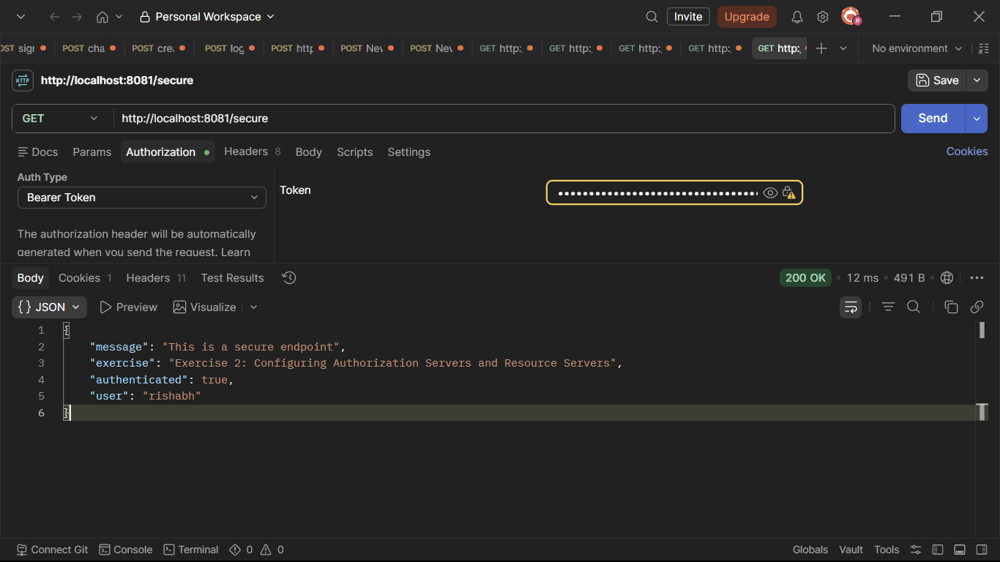
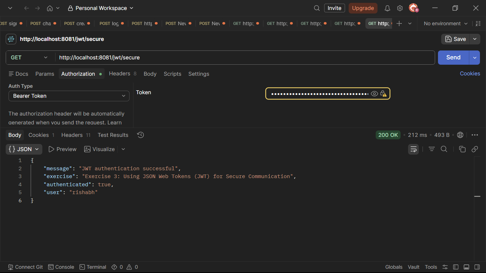

# Exercise 1 – Implementing Centralized Authentication with OAuth 2.1/OIDC

A Spring Boot 3 application implementing all hands-on exercises from **Sample Exercises on Centralized Authentication and SSO with Spring Boot 3 and Spring Cloud**.

## Features Implemented

- Spring Security
- OAuth2 Client
- OAuth2 Login
- Security Configuration
- Authenticated User Endpoint
- OIDC User Information

# Project Structure

```text
centralized-auth-sso-exercises
│
├── outputs
│   ├── auth-sso-out1.png
│   ├── auth-sso-out2.png
│   └── auth-sso-out3.png
│
├── src/main/java/com/cognizant/authsso
│   ├── config
│   ├── controller
│   ├── dto
│   ├── jwt
│   └── AuthSsoApplication.java
│
├── src/main/resources
│   └── application.yml
│
├── pom.xml
└── README.md
```

## API Endpoints

| Method | Endpoint | Description |
|--------|----------|-------------|
| GET | `http://localhost:8081/user` | Returns the authenticated user principal after OAuth2 login |
| GET | `http://localhost:8081/user-info` | Returns authenticated user details, authorities and OIDC claims |

## Output

```text
outputs/auth-sso-out1.png
```


---

# Exercise 2 – Configuring Authorization Servers and Resource Servers

## Features Implemented

- OAuth2 Resource Server
- JWT Resource Protection
- Spring Security Authorization
- Secure REST Endpoint

## API Endpoints

### Generate JWT Token

```text
GET http://localhost:8081/auth/token?username=Rajkaran
```

### Access Protected Resource

```text
GET http://localhost:8081/secure

Authorization: Bearer <TOKEN>
```

| Method | Endpoint | Description |
|--------|----------|-------------|
| GET | `http://localhost:8081/auth/token?username=Rajkaran` | Generates a JWT token |
| GET | `http://localhost:8081/secure` | Protected Resource Server endpoint requiring JWT |

## Output

```text
outputs/auth-sso-out2.png
```



---

# Exercise 3 – Using JSON Web Tokens (JWT) for Secure Communication

## Features Implemented

- JWT Configuration
- JWT Token Provider
- JWT Authentication Filter
- JWT Generation
- JWT Validation
- JWT Protected Endpoint

## API Endpoints

### Generate JWT

```text
GET http://localhost:8081/auth/token?username=Rajkaran
```

### Access JWT Protected Endpoint

```text
GET http://localhost:8081/jwt/secure

Authorization: Bearer <TOKEN>
```

| Method | Endpoint | Description |
|--------|----------|-------------|
| GET | `http://localhost:8081/auth/token?username=Rajkaran` | Generates JWT Token |
| GET | `http://localhost:8081/jwt/secure` | JWT Protected Endpoint |

## Output

```text
outputs/auth-sso-out3.png
```



---

# Additional Application Endpoints

| Method | Endpoint | Description |
|--------|----------|-------------|
| GET | `http://localhost:8081/` | Application Status Endpoint |
| GET | `http://localhost:8081/public` | Public Endpoint (No Authentication Required) |

---

# Complete API Summary

| Method | Endpoint | Authentication |
|--------|----------|----------------|
| GET | `http://localhost:8081/` | Public |
| GET | `http://localhost:8081/public` | Public |
| GET | `http://localhost:8081/user` | OAuth2 Login |
| GET | `http://localhost:8081/user-info` | OAuth2 Login |
| GET | `http://localhost:8081/auth/token?username=Rajkaran` | Public |
| GET | `http://localhost:8081/secure` | JWT Token |
| GET | `http://localhost:8081/jwt/secure` | JWT Token |
