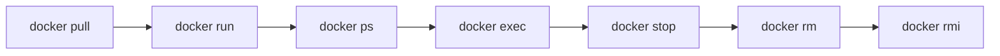
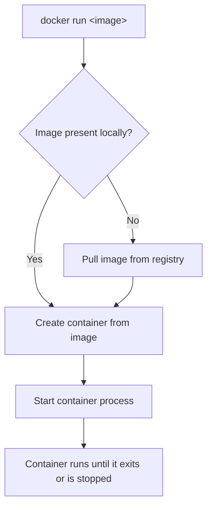
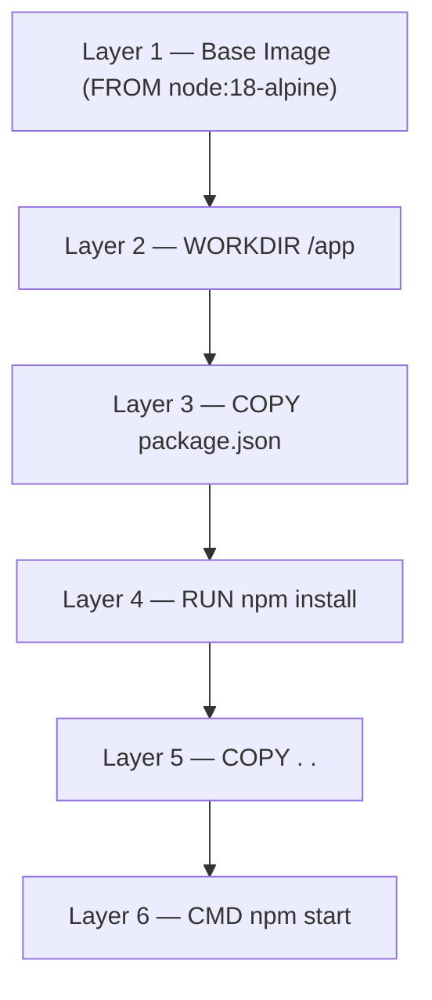
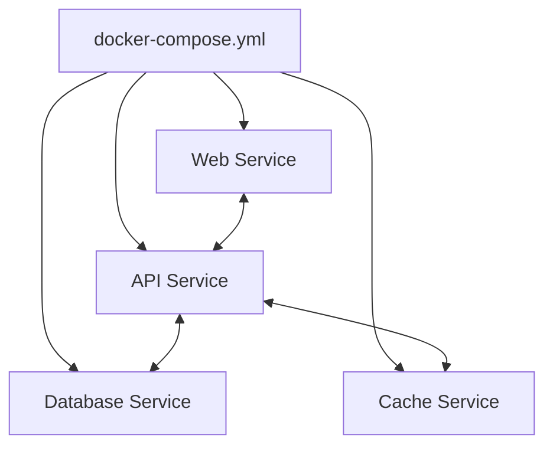
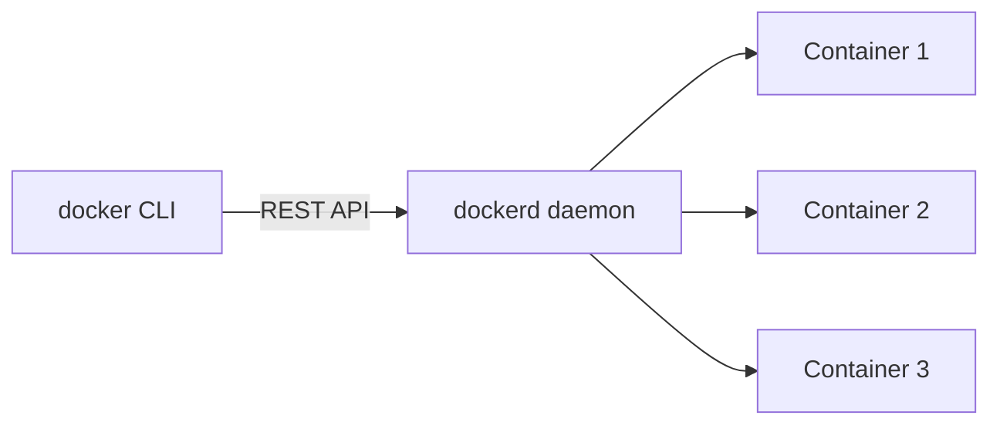
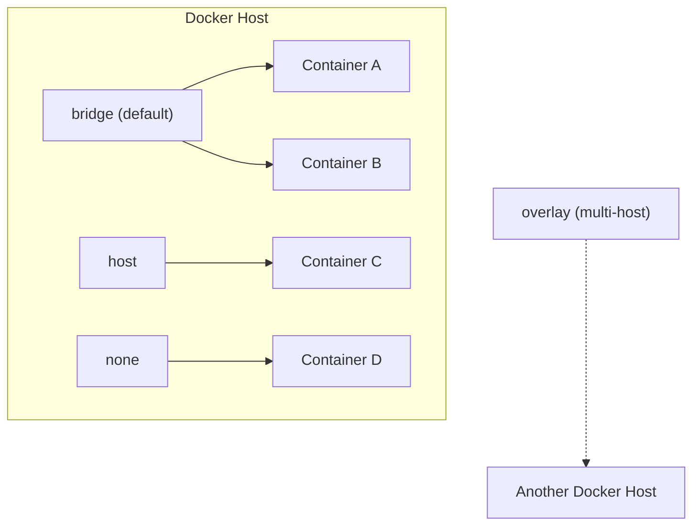
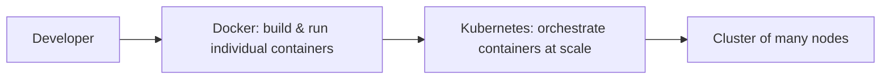

# Docker & Container Orchestration — Notes


> **Overview:** Notes covering Docker fundamentals — from everyday CLI commands to images, Compose, the engine, storage, networking, and how orchestration tools like Kubernetes take over once you outgrow a single host.

---

## Table of Contents

1. [Docker Commands](#1-docker-commands)
2. [Docker Run](#2-docker-run)
3. [Docker Images](#3-docker-images)
4. [Docker Compose](#4-docker-compose)
5. [Docker Engine](#5-docker-engine)
6. [Docker Storage](#6-docker-storage)
7. [Docker Networking](#7-docker-networking)
8. [Container Orchestration](#8-container-orchestration)
9. [Quick Recap](#9-quick-recap)
10. [Reference Links](#10-reference-links)

---

## 1. Docker Commands

The everyday Docker workflow boils down to a small set of commands you'll use constantly: pull an image, run it, check on it, then clean up.



*The typical container lifecycle: pull → run → inspect → exec into it if needed → stop → remove container → remove image.*

| Command | What it does |
|---|---|
| `docker pull <image>` | Downloads an image from a registry (Docker Hub by default) |
| `docker run <image>` | Creates **and** starts a new container from an image |
| `docker ps` | Lists running containers; add `-a` to see stopped ones too |
| `docker exec -it <container> <cmd>` | Runs a command inside an already-running container |
| `docker stop <container>` | Gracefully stops a running container (sends `SIGTERM`) |
| `docker rm <container>` | Removes a stopped container |
| `docker images` | Lists all images stored locally |
| `docker rmi <image>` | Removes a local image |

```bash
# A typical day-one sequence
docker pull nginx
docker run -d --name web nginx
docker ps
docker exec -it web bash
docker stop web
docker rm web
docker rmi nginx
```

**Handy flags to remember:**
- `-d` → run in detached (background) mode
- `-it` → interactive mode with a terminal attached
- `--rm` → automatically remove the container once it exits
- `-a` (with `ps` or `images`) → show everything, not just active items

---

## 2. Docker Run

`docker run` is the single most-used Docker command — it pulls the image if it isn't already local, creates a container from it, and starts it.

### Common variations

```bash
# Run a container with a specific name
docker run --name my_container ubuntu:latest

# Run in the background (detached mode)
docker run -d nginx

# Run interactively with a terminal attached
docker run -it ubuntu:latest bash

# Publish a container port to the host
docker run -p 8080:80 nginx

# Remove the container automatically once it finishes
docker run --rm alpine echo "hello and bye"

# Combine everything: interactive, volume mount, port mapping, env variable
docker run -it -v /mydata:/tmp -p 8080:80 -e myuser=admin ubuntu:latest
```

### What happens behind the scenes



- **Named containers** make it far easier to reference them later instead of memorizing random container IDs.
- **Detached mode (`-d`)** keeps long-running services (web servers, databases) running in the background.
- **Interactive mode (`-it`)** is what you want when you need a shell inside the container to poke around.
- **Port publishing (`-p host:container`)** is what actually makes a containerized service reachable from outside.

---

## 3. Docker Images

If a Dockerfile is the recipe, a Docker image is the ready-to-use meal made from it — portable, and guaranteed to behave the same on any machine that runs it.

### Layers, all the way down

An image isn't one giant file — it's a stack of **read-only layers**, where each instruction in a Dockerfile (`FROM`, `RUN`, `COPY`, etc.) adds a new layer on top of the last one.



Because layers are cached, changing one instruction only forces a rebuild of that layer and everything after it — earlier layers are reused as-is, which is exactly why builds get fast once the cache warms up.

### Key terms

| Term | Meaning |
|---|---|
| **Parent / Base Image** | The image your Dockerfile starts `FROM` — a minimal OS, a language runtime, or another app image |
| **Container Registry** | A storage & distribution system for images (Docker Hub is the default public one) |
| **Container Repository** | A named collection of related images inside a registry, distinguished by tags |
| **Docker Manifest** | A JSON document listing an image's layers, config, and supported platforms |

### Building an image

**Interactive method** — quick for experiments, but hard to reproduce or version.

**Dockerfile method** — the standard, repeatable way used in real projects:

```dockerfile
FROM node:18-alpine
WORKDIR /app
COPY package*.json ./
RUN npm install
COPY . .
CMD ["npm", "start"]
```

```bash
# The build context (the "." here) is the directory Docker can see while building
docker build -t my-app:1.0 .
```

The **build context** is the set of files Docker has access to during the build — this is why keeping unnecessary files out of it (via `.dockerignore`) keeps builds fast and images lean.

---

## 4. Docker Compose

Running one container by hand is easy. Running five containers that all need to talk to each other — a web app, an API, a database, a cache — by hand quickly turns into unmanageable `docker run` commands with a dozen flags each.

**Docker Compose** solves this by describing your entire multi-container application — services, networks, and volumes — in a single YAML file, then bringing it all up with one command.



### Example `docker-compose.yml`

```yaml
version: "3.9"
services:
  web:
    image: nginx:latest
    ports:
      - "8080:80"
    depends_on:
      - api

  api:
    build: ./api
    environment:
      - DB_HOST=db
    depends_on:
      - db

  db:
    image: postgres:16
    environment:
      - POSTGRES_PASSWORD=example
    volumes:
      - db-data:/var/lib/postgresql/data

volumes:
  db-data:
```

### Basic Compose commands

```bash
docker compose up -d        # start every service in the background
docker compose ps           # see the status of each service
docker compose logs -f api  # follow logs for one service
docker compose down         # stop and remove everything Compose created
```

### Why teams use it

- **One YAML file** instead of many long `docker run` commands
- **Automatic networking** — services can reach each other by name (`db`, `api`) with no manual IP wiring
- **Declared volumes** so data outlives container restarts
- Great fit for local development and single-host deployments; once you need multi-host scaling, that's where Kubernetes takes over (see Section 8)

---

## 5. Docker Engine

The Docker Engine is the core software that actually creates, runs, and manages containers on a host. It's made up of two main pieces:



- **`dockerd` (the daemon)** — the background server process that does the actual work: building images, running containers, managing networks and volumes.
- **`docker` (the CLI)** — the command-line tool you type commands into; it talks to `dockerd` over a REST API.

Docker Engine also ships with **Swarm mode**, Docker's own built-in clustering and orchestration feature — it can group several Docker hosts into a single cluster and keep containers running across them, though most production teams today reach for Kubernetes instead for advanced orchestration.

---

## 6. Docker Storage

By default, anything written inside a container's filesystem disappears the moment that container is removed. **Volumes** are Docker's answer to making data outlive a container.

| Concept | Description |
|---|---|
| **Storage Driver** | Manages how image layers and container filesystems are stored on disk (e.g. `overlay2`, the current default on Linux) |
| **Docker Volume** | A storage location managed by Docker, living outside any single container's filesystem, and persisting even after the container is removed |
| **Bind Mount** | Maps a specific file or folder from the host straight into the container |

### Common volume commands

```bash
docker volume create my-data       # create a named volume
docker volume ls                   # list all volumes
docker volume inspect my-data      # see where it lives on the host
docker run -v my-data:/app/data my-image   # mount it into a container
docker volume rm my-data           # remove it
```

### Why it matters

- Databases need their data to survive container restarts and rebuilds.
- Log files and uploaded content shouldn't vanish just because a container was redeployed.
- Multiple containers can share the same volume when they need access to the same files.

---

## 7. Docker Networking

Containers need to talk to each other, to the host, and to the outside world — Docker's built-in network drivers control exactly how.



| Driver | Behavior |
|---|---|
| **bridge** (default) | Private, single-host network; containers talk to each other, and need port mapping to be reached from outside |
| **host** | Removes network isolation entirely — the container shares the host's network stack directly |
| **none** | Full isolation — no networking at all beyond a loopback interface |
| **overlay** | Connects containers running across *multiple* Docker hosts — used with Swarm/clustered setups |
| **macvlan** | Gives a container its own MAC address so it appears as a physical device on the network |

### Working with networks

```bash
docker network ls                                 # list all networks
docker network create my-network                  # create a custom bridge network
docker network inspect my-network                 # see connected containers & driver details
docker network connect my-network my-container     # attach a container to a network
docker network disconnect my-network my-container  # detach it
docker network rm my-network                       # delete the network
```

**Worth knowing:** on the *default* bridge network, containers can only reach each other by IP address, which changes on every restart. On a **custom** bridge network (or one created by Compose), Docker runs an internal DNS server so containers can reach each other by **name** instead — much more reliable.

---

## 8. Container Orchestration

Docker is great at running one container. Once an application grows to dozens or hundreds of containers across multiple machines, running everything by hand becomes impossible — that's the problem **container orchestration** solves.

### Why we need it

- Automatically restart containers that crash
- Spread containers across many hosts and scale them up or down on demand
- Roll out new versions without downtime
- Route traffic to healthy containers only

### Docker vs Kubernetes — what's the actual split



| | Docker (+ Compose) | Kubernetes |
|---|---|---|
| Scope | Build and run containers; Compose handles multi-container apps on **one host** | Orchestrates containers across **many hosts** (a cluster) |
| Scaling | Manual / limited | Automatic scaling, self-healing, rolling updates |
| Best for | Local dev, small single-node deployments | Large-scale, production, multi-tenant systems |
| Origin | Docker, Inc. | Originally built at Google, now maintained by the CNCF |

### Docker Compose vs Kubernetes

- **Docker Compose** is simplest when everything fits comfortably on one machine — quick to set up, easy to reason about.
- **Kubernetes** takes over once you need self-healing, multi-node scaling, rolling deployments, and isolated multi-tenant workloads — at the cost of a steeper learning curve and more moving parts (Pods, Nodes, Kubelet, kube-proxy, etc.).

A common growth path: start with Compose for local development, move to Kubernetes (or Docker Swarm as a lighter-weight option) once the app needs to run reliably at scale in production.

---

## 9. Quick Recap

- **Docker Commands** – `pull → run → ps → exec → stop → rm → rmi` is the core loop you'll repeat constantly
- **Docker Run** – the single command that pulls (if needed), creates, and starts a container
- **Docker Images** – layered, cacheable, and built from a Dockerfile inside a defined build context
- **Docker Compose** – one YAML file to define and run a whole multi-container application
- **Docker Engine** – the `dockerd` daemon + `docker` CLI duo that actually runs everything
- **Docker Storage** – volumes and bind mounts keep data alive beyond a container's lifecycle
- **Docker Networking** – bridge, host, none, and overlay drivers control how containers reach each other and the outside world
- **Container Orchestration** – Kubernetes (or Swarm) takes over once a single host and Compose aren't enough

---

## 10. Reference Links

- [Docker Tutorial – GeeksforGeeks](https://www.geeksforgeeks.org/docker-tutorial/)
- [Docker Run Command – GeeksforGeeks](https://www.geeksforgeeks.org/devops/docker-run-command/)
- [What is Docker Image – GeeksforGeeks](https://www.geeksforgeeks.org/devops/what-is-docker-image/)
- [Docker Compose – GeeksforGeeks](https://www.geeksforgeeks.org/devops/docker-compose/)
- [What is Docker Engine – GeeksforGeeks](https://www.geeksforgeeks.org/devops/what-is-docker-engine/)
- [Docker Compose Volumes for Container Data – GeeksforGeeks](https://www.geeksforgeeks.org/devops/docker-compose-volumes-for-container-data/)
- [Docker Networking – GeeksforGeeks](https://www.geeksforgeeks.org/devops/basics-of-docker-networking/)
- [Introduction to Kubernetes – GeeksforGeeks](https://www.geeksforgeeks.org/cloud-computing/kubernetes-introduction-to-container-orchestration/)

---
