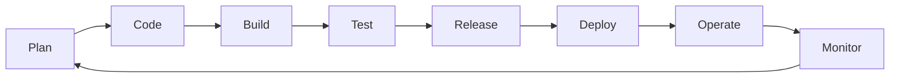
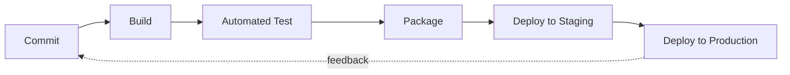
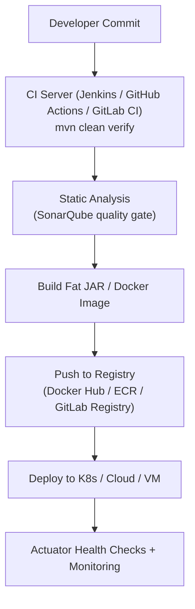

# Module 12 – DevOps and CI/CD


> **Overview:** This module is based on how Development and Operations work together in today's business delivery model — and how Continuous Integration / Continuous Deployment (CI/CD) makes that collaboration practical.

---

## Learning Objectives

After completing this module, you will be able to:

- Explain the core concepts of DevOps
- Explain the components of DevOps — Continuous Integration and Continuous Delivery
- List the popular tools used in DevOps pipelines
- Understand how a Spring Boot application moves from code commit to production

---

## Table of Contents

1. [Introduction to DevOps](#1-introduction-to-devops)
2. [Understanding CI/CD](#2-understanding-cicd)
3. [CI/CD Tools and Platforms](#3-cicd-tools-and-platforms)
4. [CI/CD & Deployment for Spring Boot](#4-cicd--deployment-for-spring-boot)
5. [Quick Recap](#5-quick-recap)
6. [Reference Links](#6-reference-links)

---

## 1. Introduction to DevOps

### What is DevOps?

DevOps is a cultural and technical movement that merges **Development (Dev)** and **Operations (Ops)** into a single, collaborative workflow instead of two separate silos. Rather than developers "throwing code over the wall" to an operations team, both groups share responsibility for building, testing, releasing, and running software.

At its heart, DevOps is not a tool — it's a mindset backed by automation, shared ownership, and fast feedback loops between the people who write code and the people who keep it running in production.



*The DevOps lifecycle — planning, coding, building, testing, releasing, deploying, operating, and monitoring, arranged as a continuous loop.*

### Goals and Benefits of DevOps

| Goal | Benefit |
|---|---|
| Faster software delivery | Frequent, smaller releases instead of large risky ones |
| Better collaboration | Shared accountability between Dev, QA, and Ops removes blame games |
| Automation of repetitive work | Less manual error, more time for high-value engineering |
| Continuous feedback | Issues are caught and fixed early, before they reach users |
| Improved reliability | Monitoring and alerting keep production systems healthy |

Companies like Amazon and Netflix are commonly cited as organizations that scaled their user experience dramatically after adopting DevOps practices.

### Key DevOps Practices

- **Version Control** – Git-based source management so every change is tracked
- **Continuous Integration** – merging and testing code frequently
- **Continuous Delivery / Deployment** – automated release pipelines
- **Infrastructure as Code (IaC)** – provisioning servers through code (Terraform, Ansible)
- **Monitoring & Logging** – observability tools like Prometheus, Grafana, and the ELK stack
- **Containerization** – packaging apps consistently with Docker and orchestrating with Kubernetes

> DevOps sits at the intersection of three disciplines: **Development**, **Quality Assurance**, and **Technology Operations** — no single team owns it alone.

---

## 2. Understanding CI/CD

### What is Continuous Integration (CI)?

Continuous Integration is the practice of merging every developer's code changes into a shared main branch **frequently — often several times a day.** Each merge automatically triggers a build and a suite of automated tests.

- **Goal:** avoid "integration hell," where merging code becomes painful because branches have drifted apart for too long
- **Process:** commit → automatic build → automatic unit tests → pass/fail feedback within minutes
- **Outcome:** if a test fails, the team is notified immediately and the broken build is rejected before it can affect anyone else

### What is Continuous Delivery / Continuous Deployment (CD)?

"CD" is used for two related but different practices:

- **Continuous Delivery** – every change that passes the pipeline is automatically packaged and made *release-ready*, but a human still clicks the button to push it to production.
- **Continuous Deployment** – goes one step further and pushes every passing change straight to production with **no manual approval step** at all.

### CI vs CD — Side by Side

| Aspect | Continuous Integration | Continuous Delivery | Continuous Deployment |
|---|---|---|---|
| Focus | Merge + build + test code | Prepare a tested build for release | Automatically ship to production |
| Human approval | N/A (automated tests only) | Required before final release | Not required |
| Frequency | Multiple times per day | On demand / scheduled | Every successful pipeline run |
| Risk if skipped | Integration conflicts pile up | Releases become big & risky | N/A – deployment is instant |

### Why CI/CD Matters

- Smaller, frequent updates replace large, risky "big bang" releases
- Bugs are caught close to the point where they were introduced (fail fast)
- Teams following mature CI/CD practices ship far more often and recover from failures much faster than teams that don't
- Improves transparency: everyone can see the state of the build and the pipeline at any time



*A typical CI/CD pipeline: commit → build → automated test → package → deploy to staging → deploy to production, with feedback flowing back to the team.*

Plain-text version (in case Mermaid isn't rendered on your viewer):

```
 Commit -> Build -> Test -> Package -> Deploy (Staging) -> Deploy (Production)
                                              ^
                                              |
                                  Continuous Feedback Loop
```

---

## 3. CI/CD Tools and Platforms

There are several mature platforms that implement CI/CD pipelines. They all automate the same core stages (build → test → deploy) but differ in hosting model, ecosystem, and ease of setup.

   

| Tool | Type | Strengths | Good for |
|---|---|---|---|
| **Jenkins** | Self-hosted, open source | Huge plugin ecosystem (1,800+ plugins), full control over infrastructure | Complex, custom, on-prem pipelines |
| **GitHub Actions** | SaaS, built into GitHub | Lives right next to your code, event-driven workflows, huge marketplace of actions | Teams already using GitHub |
| **GitLab CI/CD** | SaaS / self-hosted | Complete DevOps platform in one tool (repo + CI + registry + security scans) | Teams wanting an all-in-one lifecycle tool |
| **CircleCI** | SaaS | Known for fast builds, strong Docker support, generous caching | Performance-focused teams |

### At a glance

- **Jenkins** – maximum flexibility, but you own the setup, upgrades, and maintenance.
- **GitHub Actions** – simplest to adopt if your code already lives on GitHub; pipelines are defined in YAML workflow files stored in `.github/workflows/`.
- **GitLab CI/CD** – strong choice when you want source control, CI, container registry, and security scanning bundled together.
- **CircleCI** – popular where raw pipeline speed and Docker-native builds matter most.

There is no single "best" tool — the right choice depends on where your code already lives, your team's operational maturity, and how much infrastructure control you need.

---

## 4. CI/CD & Deployment for Spring Boot

Spring Boot applications are built to be "production ready out of the box," which makes them a natural fit for CI/CD pipelines. Per the official Spring Boot documentation, production-focused topics include efficient deployment of the executable JAR, GraalVM native images, and the Actuator module for health/metrics endpoints.

### Packaging a Spring Boot App for Production

Spring Boot supports two common packaging styles:

- **Executable (fat) JAR** – bundles your code, dependencies, and an embedded server (Tomcat/Jetty/Undertow) into one self-contained JAR. This is the most common choice for cloud-native and containerized deployments.
- **WAR file** – used when you need to deploy into an existing external application server, common in some enterprise environments.

```bash
# Build the executable jar with Maven
mvn clean package

# Run it directly — no external server needed
java -jar target/my-app-0.0.1-SNAPSHOT.jar
```

Adding `spring-boot-actuator` gives you production-ready endpoints for health checks, metrics, and auditing — extremely useful for monitoring after a CI/CD pipeline deploys your build.

### Example: GitHub Actions Workflow for a Spring Boot + Maven App

```yaml
name: Spring Boot CI/CD

on:
  push:
    branches: [ "main" ]
  pull_request:
    branches: [ "main" ]

jobs:
  build-and-test:
    runs-on: ubuntu-latest
    steps:
      - uses: actions/checkout@v4

      - name: Set up JDK 17
        uses: actions/setup-java@v4
        with:
          java-version: '17'
          distribution: 'temurin'

      - name: Build with Maven
        run: mvn -B clean verify

      - name: Run SonarQube Analysis
        run: mvn sonar:sonar -Dsonar.projectKey=my-spring-app

      - name: Build Docker image
        run: docker build -t my-org/my-spring-app:${{ github.sha }} .

      - name: Push image & deploy
        run: echo "push to registry and trigger deployment step here"
```

### Example: Simple Jenkinsfile for a Spring Boot Microservice

```groovy
pipeline {
    agent any
    stages {
        stage('Checkout') {
            steps { git branch: 'main', url: 'https://github.com/org/my-spring-app.git' }
        }
        stage('Build') {
            steps { sh 'mvn clean package -DskipTests' }
        }
        stage('Test') {
            steps { sh 'mvn test' }
        }
        stage('Static Analysis') {
            steps { sh 'mvn sonar:sonar' }
        }
        stage('Docker Build & Push') {
            steps {
                sh 'docker build -t my-registry/my-spring-app:$BUILD_NUMBER .'
                sh 'docker push my-registry/my-spring-app:$BUILD_NUMBER'
            }
        }
        stage('Deploy') {
            steps { sh 'kubectl rollout restart deployment/my-spring-app' }
        }
    }
}
```

### Spring Boot Deployment Flow



Plain-text version (in case Mermaid isn't rendered on your viewer):

```
Developer Commit
   -> CI Server (mvn clean verify)
   -> Static Analysis (SonarQube quality gate)
   -> Build Fat JAR / Docker Image
   -> Push to Registry (Docker Hub / ECR / GitLab Registry)
   -> Deploy to K8s / Cloud / VM
   -> Actuator Health Checks + Monitoring
```

---

## 5. Quick Recap

- **DevOps** = culture + automation that unites Dev and Ops
- **CI** = merge & test code constantly
- **CD** = automatically prepare (Delivery) or automatically ship (Deployment) that tested code
- **Tools** like Jenkins, GitHub Actions, GitLab CI, and CircleCI all automate the same build → test → deploy flow, just with different trade-offs
- **Spring Boot** is designed to be production-ready, which is exactly why it plugs so naturally into a CI/CD pipeline

---

## 6. Reference Links

- [DevOps Tutorial – GeeksforGeeks](https://www.geeksforgeeks.org/devops-tutorial/)
- [Introduction to DevOps – GeeksforGeeks](https://www.geeksforgeeks.org/introduction-to-devops/)
- [What is CI/CD – GeeksforGeeks](https://www.geeksforgeeks.org/what-is-ci-cd/)
- [Spring Boot Reference Documentation](https://docs.spring.io/spring-boot/documentation.html)
- [Spring Boot – Packaging for Production](https://docs.spring.io/spring-boot/reference/using/packaging-for-production.html)
- [GitHub – What is CI/CD](https://github.com/resources/articles/ci-cd)
- [GitLab – CI/CD Pipeline](https://about.gitlab.com/topics/ci-cd/cicd-pipeline/)

---

*Notes prepared for Module 12 – DevOps and CICD.*
