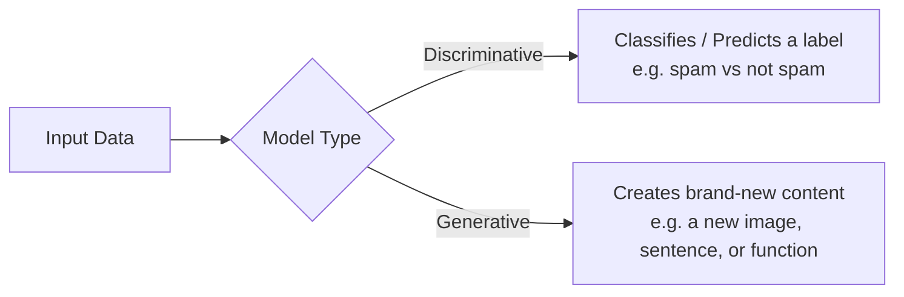
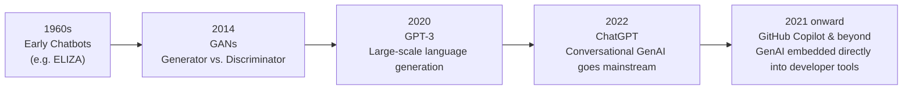
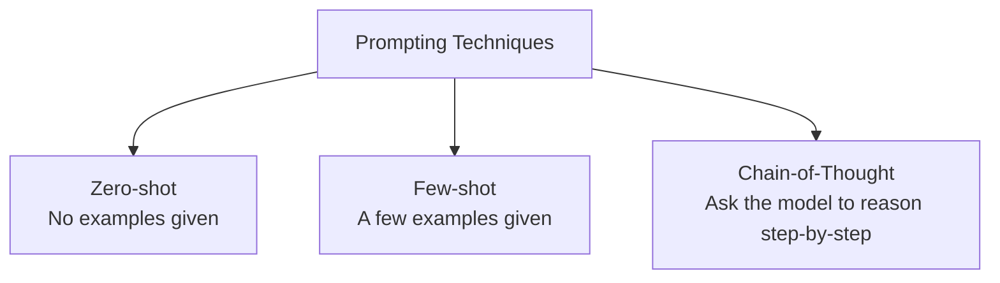
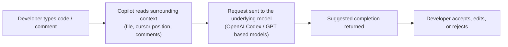
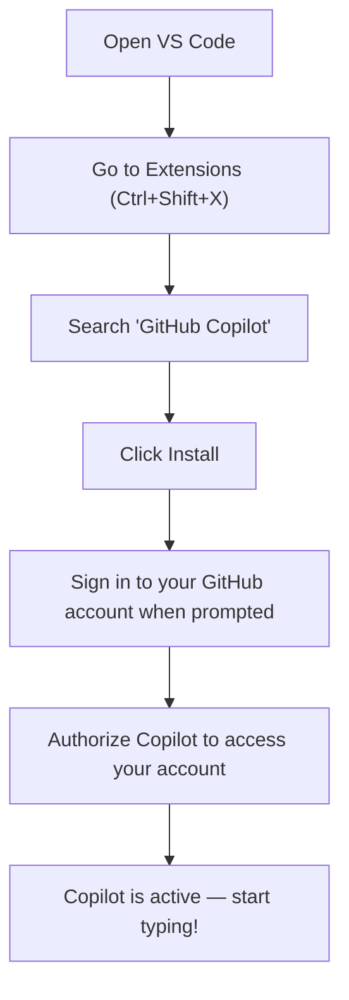
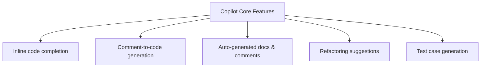
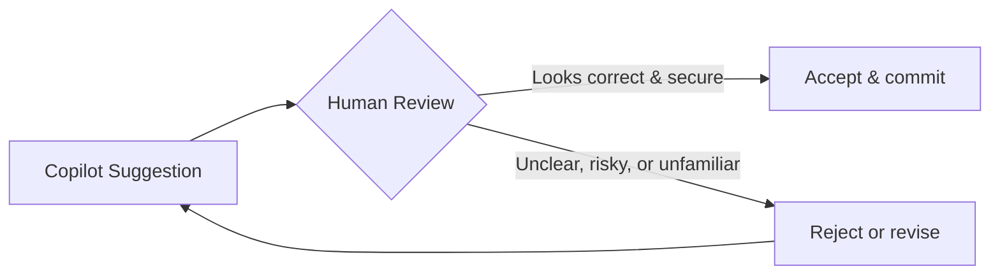

# Generative AI, Prompt Engineering & GitHub Copilot — Notes


> **Overview:** Notes covering what Generative AI actually is, how to talk to it effectively through prompt engineering, and how those ideas show up in a real developer tool — GitHub Copilot.

---

## Table of Contents

1. [Introduction to Generative AI](#1-introduction-to-generative-ai)
2. [Prompt Engineering — Techniques, Best Practices & Ethics](#2-prompt-engineering--techniques-best-practices--ethics)
3. [Introduction to GitHub Copilot](#3-introduction-to-github-copilot)
4. [Setup and Configuration](#4-setup-and-configuration)
5. [Core Features and Capabilities](#5-core-features-and-capabilities)
6. [Security and Ethical Considerations](#6-security-and-ethical-considerations)
7. [Quick Recap](#7-quick-recap)
8. [Reference Links](#8-reference-links)

---

## 1. Introduction to Generative AI

### What is Generative AI?

**Generative AI (GenAI)** refers to models that learn the underlying patterns in existing data and then use that knowledge to **create new content** — text, images, audio, video, or code — rather than just analyzing or labeling what already exists.

### How GenAI Differs from Traditional (Discriminative) AI



| | Discriminative AI | Generative AI |
|---|---|---|
| Core question | "Which category does this belong to?" | "What could new data like this look like?" |
| Typical output | A label, class, or probability | New text, images, audio, video, or code |
| Example task | Spam detection, fraud detection | Writing an essay, generating an image, autocompleting code |
| Common architectures | Logistic regression, SVMs, standard classifiers | GANs, VAEs, Transformers / diffusion models |

### Overview of GenAI Applications

- **Text generation** — drafting emails, articles, summaries (e.g. ChatGPT, Claude)
- **Code completion** — suggesting functions and boilerplate as you type (e.g. GitHub Copilot)
- **Image creation** — generating original images from text prompts (e.g. DALL·E, Stable Diffusion)
- **Chatbots** — conversational assistants that answer questions and help with tasks

### History and Evolution of Generative AI



- **1960s — Early chatbots**: rule-based programs like ELIZA simulated conversation using scripted pattern matching.
- **2014 — GANs**: Generative Adversarial Networks pit a "generator" against a "discriminator," producing increasingly realistic images.
- **2020 — GPT-3**: a major leap in large language models, capable of writing essays, answering questions, and even generating code.
- **2022 — ChatGPT**: brought conversational GenAI to a mass audience, making natural-language interaction with AI mainstream.
- **GitHub Copilot and beyond**: GenAI moved from a standalone chat experience into being embedded directly inside developer tools and IDEs.

---

## 2. Prompt Engineering — Techniques, Best Practices & Ethics

### What is Prompt Engineering and Why It Matters for Developers

**Prompt engineering** is the practice of crafting inputs (prompts) so that a language model produces the most accurate, useful, and well-structured output. Since LLMs don't automatically know exactly what output format, tone, or depth you want, a well-designed prompt is often the difference between a mediocre answer and a great one.

### Prompting Techniques



| Technique | How it works | Best for |
|---|---|---|
| **Zero-shot prompting** | Give the model a direct instruction with no examples — it relies purely on what it learned during training | Quick, general tasks the model already understands well |
| **Few-shot prompting** | Provide a small number of example input/output pairs before the real task | Tasks needing a specific format, tone, or style |
| **Chain-of-thought (CoT) prompting** | Ask the model to reason step-by-step (e.g. "Let's think step by step") before giving a final answer | Math, logic, multi-step reasoning, and complex coding tasks |

**Example — Chain-of-thought prompting:**
```
Q: If a shop sells 3 pens for ₹30, how much will 7 pens cost?
Let's think step by step.

3 pens = ₹30 → 1 pen = ₹10 → 7 pens = 7 × 10 = ₹70
Final Answer: ₹70
```

Chain-of-thought prompting tends to improve accuracy on reasoning-heavy tasks and makes the model's logic more transparent — at the cost of using more tokens per response.

### Best Practices for Prompting

- **Be clear and specific** — vague prompts get vague answers
- **Provide context** — background info helps the model tailor its response
- **Specify the output format** — e.g. "respond in 3 bullet points" or "return only valid JSON"
- **Iterate** — treat your first prompt as a draft, then refine based on the result
- **Use examples (few-shot)** when the desired format or style isn't obvious from instructions alone

### Ethical Considerations

- **Avoiding bias in prompts** — prompts (and the model's training data) can encode and amplify social or cultural biases; phrase requests neutrally and review outputs critically
- **Accuracy** — models can produce confident-sounding but incorrect ("hallucinated") answers; verify anything factual or safety-critical
- **Privacy** — avoid pasting sensitive personal or proprietary data into prompts sent to third-party models
- **Responsible AI usage** — be transparent about AI-assisted content where it matters, and keep a human reviewing high-stakes outputs

### Hands-on Example: Writing a Coding-Task Prompt

```
Write a C# method that takes a list of integers and returns
only the even numbers, sorted in ascending order.
Include a docstring and one usage example.
```

Notice this prompt specifies the language, the exact behavior, and the expected extras (docstring + example) — that specificity is what separates a strong prompt from a weak one.

---

## 3. Introduction to GitHub Copilot


### What is GitHub Copilot?

**GitHub Copilot** is an AI-powered coding assistant built by GitHub and OpenAI. It behaves like an AI pair programmer, suggesting code completions, entire functions, and even tests directly inside your editor as you type.

### How Copilot Works



Copilot was originally powered by **OpenAI Codex**, a version of GPT trained specifically on public code (in addition to natural language), which is why it can turn a plain-English comment into working code. Copilot has since expanded to support multiple model providers.

### Supported IDEs and Languages

- **IDEs:** Visual Studio Code, Visual Studio, JetBrains IDEs (IntelliJ, PyCharm, etc.), Neovim
- **Languages:** works across most popular languages (Python, JavaScript/TypeScript, Java, C#, Go, Ruby, and many more) since it was trained on a huge cross-section of public code

---

## 4. Setup and Configuration

### Installing the GitHub Copilot Extension in VS Code



1. **Open VS Code** and go to the Extensions panel (`Ctrl+Shift+X`)
2. **Search for "GitHub Copilot"** and click Install
3. **Sign in** to your GitHub account through the IDE when prompted
4. **Authorize** GitHub Copilot to access your GitHub account
5. Copilot is now active — start typing a comment or function signature and watch it suggest completions

### Connecting to a GitHub Account

Copilot requires an active GitHub account with a Copilot subscription (a free tier exists with limited completions; students, teachers, and open-source maintainers can often get it free).

### A Beginner-Friendly First Task

Try typing a comment like this in a new file and see what Copilot suggests:

```python
# Function that takes a list of numbers and returns their average
```

Copilot will typically suggest a complete function body beneath the comment — accept it with `Tab`, or keep typing to see alternative suggestions.

---

## 5. Core Features and Capabilities

| Feature | What it does |
|---|---|
| **Code suggestions & completions** | Suggests the next line (or several lines) of code as you type; accept with `Tab` |
| **Writing functions from comments** | Turn a plain-English comment into a working function or boilerplate code |
| **Generating comments & documentation** | Automatically draft docstrings/comments explaining existing code |
| **Refactoring and optimizing code** | Suggest cleaner or more efficient rewrites of existing code |
| **Creating test cases** | Generate unit tests based on the function's behavior |



---

## 6. Security and Ethical Considerations

### Understanding AI-Generated Code Risks

- **Vulnerabilities** — Copilot can suggest code with subtle security flaws (e.g. weak input validation, unsafe deserialization) since it's trained on a huge mix of public code, not all of which follows best practices
- **Hallucinations** — Copilot can suggest calls to packages or APIs that don't actually exist; attackers have exploited this ("hallucination squatting") by publishing malicious packages under those fabricated names
- **Secrets leakage** — Copilot reads the files open in your editor, so hardcoded credentials, API keys, or tokens in your codebase could end up reflected in suggestions

### Licensing and Attribution

Copilot suggestions are drawn from patterns in publicly available code, some of which is under **copyleft licenses** (like GPL). Because Copilot doesn't always attribute the origin of a suggestion, teams should scan AI-generated code for license compliance just as they would for any other open-source dependency, especially before shipping to production.

### Data Privacy and Usage Policies

- Free-tier usage may be used to help improve the underlying model — avoid pasting proprietary or regulated code into that tier
- Business/Enterprise tiers offer stronger controls: blocking suggestions that match public code, content exclusion rules, and audit logging
- Telemetry and data-sharing settings can typically be adjusted in Copilot's settings if your organization's policies require it

### Responsible Use of Copilot — Best Practices



- Always **review generated code** before committing it — treat Copilot as a powerful autocomplete, not an autonomous author
- Avoid hardcoding secrets; keep sensitive business logic out of files/comments Copilot scans
- Run security and license scans on AI-generated code as part of your normal CI pipeline
- Remember: **you own the code you ship**, even if an AI helped write it

---

## 7. Quick Recap

- **Generative AI** creates new content by learning patterns in data, unlike discriminative AI which just classifies existing data
- **Prompt engineering** — zero-shot, few-shot, and chain-of-thought prompting are the core techniques for getting better output from an LLM
- **GitHub Copilot** is GenAI embedded directly into your IDE, powered originally by OpenAI Codex, suggesting completions, functions, docs, and tests
- **Security & ethics** — always review AI-generated code for vulnerabilities, license issues, and leaked secrets before shipping it

---

## 8. Reference Links

- [What is Generative AI? – GeeksforGeeks](https://www.geeksforgeeks.org/artificial-intelligence/what-is-generative-ai/)
- [Generative AI vs. Discriminative AI – GeeksforGeeks](https://www.geeksforgeeks.org/artificial-intelligence/generative-ai-vs-discriminative-ai/)
- [What is an AI Prompt Engineering – GeeksforGeeks](https://www.geeksforgeeks.org/what-is-an-ai-prompt-engineering/)
- [Zero-Shot Chain-of-Thought Prompting – GeeksforGeeks](https://www.geeksforgeeks.org/artificial-intelligence/zero-shot-chain-of-thought-prompting/)
- [GitHub Copilot – GeeksforGeeks](https://www.geeksforgeeks.org/git/github-copilot/)
- [How to Use GitHub Copilot with VS Code – freeCodeCamp](https://www.freecodecamp.org/news/how-to-use-github-copilot-with-visual-studio-code/)
- [GitHub Copilot Security and Privacy – GitGuardian Blog](https://blog.gitguardian.com/github-copilot-security-and-privacy/)
- [Responsible Use of Copilot / Code Review – GitHub Docs](https://docs.github.com/en/copilot/responsible-use/code-review)

---
